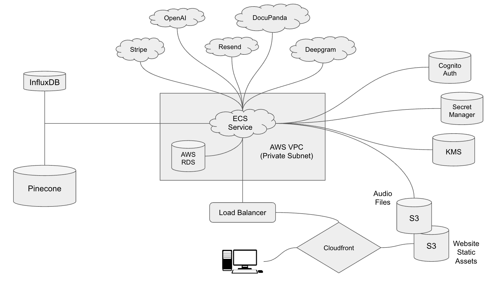

# ChartWise

ChartWise is an AI-powered platform built for mental health professionals to gain structured insights from therapy sessions. It enables clinicians to securely record, transcribe, and analyze sessions, surfacing trends and progress over time while meeting compliance requirements.

---

## 🚀 Features

- **Session Recording & Upload**: Secure audio recording of therapy sessions (45–60 min typical length), with support for chunked and streamed uploads.  
- **Automated Transcription**: High-accuracy speech-to-text via Deepgram.  
- **Insight Extraction**: Retrieval-Augmented Generation (RAG) pipeline combining PostgreSQL and Pinecone to provide context-rich insights.  
- **Realtime Updates**: Live data pipelines delivering session insights and patient dashboard updates.  
- **Data Security & Compliance**: Encryption at rest, PostgreSQL RLS, and HIPAA-oriented incident response.  
- **Scalable Infrastructure**: AWS ECS, RDS, Redis caching, CloudFront + S3, and API Gateway WebSockets.  

---

## 🏗️ Architecture Overview

- **Backend**: FastAPI app (ECS service, behind load balancer).  
- **Database**: PostgreSQL (RDS Multi-AZ) with RLS enforced per user.  
- **Vector DB**: Pinecone for semantic retrieval of transcripts.  
- **Cache**: Redis (ElastiCache).  
- **Storage**: S3 buckets for raw audio and transcript files.  
- **Encryption**: KMS-backed utilities for secure storage and retrieval.  
- **Realtime**: ECS service listening to Postgres `NOTIFY` events and publishing updates over WebSocket.  
- **Static Assets**: S3 + CloudFront for hosting.  
- **Deployment**: Docker images built and pushed to ECR, deployed via ECS with rolling updates.  


---

## 📦 Getting Started

### Prerequisites
- Python 3.11+  
- Docker & Docker Compose  
- AWS CLI with appropriate IAM permissions  
- Pinecone + Deepgram API keys  

### Local Setup
```bash
# Clone the repo
git clone https://github.com/<org>/chartwise.git
cd chartwise

# Spin up local services
docker-compose up --build

# Run database migrations
alembic upgrade head
```

The FastAPI app will be available at `http://localhost:8000`.

### Environment Variables
Create a `.env` file in the project root:

```
# AWS General
AWS_SERVICES_REGION=...
AWS_RDS_DB_PORT=...
AWS_ACCESS_KEY_ID=...
AWS_SECRET_ACCESS_KEY=...
AWS_ACCOUNT_ID=...

# AWS Specific
AWS_COGNITO_USER_POOL_ID=...
COGNITO_APP_CLIENT_ID =...
AWS_RDS_DATABASE_ENDPOINT=...
AWS_RDS_DB_NAME=...
AWS_CHARTWISE_ROLE_SESSION_NAME=...
AWS_CHARTWISE_ROLE_ARN=...
AWS_SECRET_MANAGER_CHARTWISE_USER_ROLE=...
AWS_SECRET_MANAGER_STRIPE_READER_ROLE=...
AWS_SECRET_MANAGER_STRIPE_WRITER_ROLE=...
CHARTWISE_PHI_ENCRYPTION_KEY=...
SESSION_AUDIO_FILES_PROCESSING_BUCKET_NAME=...

# General
DEBUG_MODE=...
ENVIRONMENT=...

# Deepgram
DG_URL=...
DG_LISTEN_ENDPOINT=...
DG_API_KEY=...

# Docupanda
DOCUPANDA_BASE_URL=...
DOCUPANDA_API_KEY=...
DOCUPANDA_DOCUMENT_ENDPOINT=...

# FastAPI
SESSION_TOKEN_JWT_SECRET_NAME=...

# InfluxDB
INFLUXDB_TOKEN=...
INFLUXDB_HOST=...

# OpenAI
OPENAI_API_KEY=...

# Pinecone
PINECONE_API_KEY=...

# Resend
RESEND_API_KEY=...

# Stripe
STRIPE_API_KEY=...
STRIPE_WEBHOOK_SECRET_DEBUG=...
```

---

## 🚢 Deployment

1. Run tests and build image:
   ```bash
   python test_and_deploy.py
   ```
2. Push Docker image to ECR.  
3. Deploy ECS service (via Terraform or AWS CLI).  
4. Verify service health checks through the load balancer.  

---

## 🔒 Security & Compliance

- **Encryption**: All PHI encrypted via AES-256 (KMS-wrapped keys).  
- **Access Control**: Fine-grained RLS in PostgreSQL ensures per-user data isolation.  
- **Incident Response**: Escalation procedures documented for HIPAA compliance.  
- **Audit Logging**: All access logged and versioned in CloudTrail + S3.  

---

## 🧪 Testing

```bash
pytest --maxfail=1 --disable-warnings -q
```

Test suite covers:
- FastAPI routes  
- RDS wrapper + encryption utilities  
- Background task management  

---

## 🌍 Roadmap

- Improve support for **large audio file streaming**.  
- Expand **therapist dashboards** with longitudinal progress tracking.  
- Enhance **multi-tenant support** for clinics.  
- Integrate **analytics around relapse and progress periods**.  

---

## 👥 Contributing

1. Fork the repo  
2. Create a feature branch: `git checkout -b feature/foo`  
3. Commit changes: `git commit -m "Add foo"`  
4. Push to branch: `git push origin feature/foo`  
5. Open a pull request  

---

## 📜 License

Proprietary – Copyright © ChartWise, All rights reserved.

